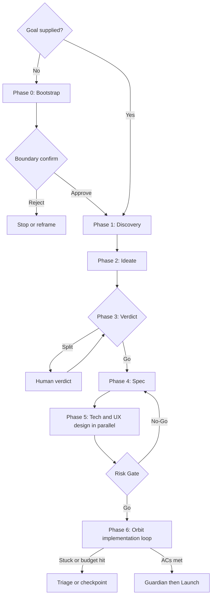

# Nexus Apex Recipe Reference

**Purpose:** End-to-end auto-implementation chain spanning discovery, ideation, decision, specification, parallel design, risk gating, implementation loop, and ship — with sub-orchestration via Vision (UX) and Orbit (implementation loop).
**Read when:** User invokes `/nexus apex` or requests "ultimate auto-implementation", full-cycle delivery from user need to release, or any chain requiring 10+ agents across discovery and implementation.

## Contents
- Overview
- When to Use Apex
- Invocation Modes
- Phase 0: Bootstrap (no-args / autonomous goal discovery)
- Phase Contracts (1 → 6 + Ship)
- Sub-Orchestration: Vision (UX) and Orbit (Loop)
- Topology Overview
- Workflow Shape Rationale
- AUTORUN Chain Template
- Failure Escalation
- Cost and Latency Profile

---

## Overview

Apex is Nexus's heaviest Recipe. It bundles **Phase 0 (autonomous goal discovery, no-args mode only) + 6 sequential phases** with two parallel sub-tracks (Tech / UX) inside Phase 5, gated by a tri-axis Risk Gate (Omen + Ripple + Echo), and executed through Orbit's autonomous loop. Apex keeps design work parallel and reconverges it at one Risk Gate so ownership, handoff count, and verification remain explicit.

Apex is **not** a default recipe. It is opt-in for high-stakes new features where every upstream gap (missed user need, weak spec, hidden architecture risk, UX friction) is materially costly to discover post-implementation.

## Invocation Modes

| Form | Behavior |
|------|----------|
| `/nexus apex <goal description>` | **Goal-supplied mode**. Skip Phase 0, start at Phase 1 with the supplied goal. |
| `/nexus apex` (no args) | **Autonomous mode**. Run Phase 0 to discover the highest-priority goal from project state + real feedback + KPI/competitive signals, confirm once at boundary, then run Phase 1-6 + Ship. |
| `/nexus apex goal=auto` | Explicit autonomous mode (same as no-args). |
| `/nexus apex goal=<X> scope=<Y>` | Goal-supplied with optional scope hints (`Lite` / `Standard` / `Full`, `ui=true/false`, `api_change=true/false`, `db_change=true/false`). |

Autonomous mode is the **fully self-driven** form: Apex picks what to build, confirms once, and ships. The single human checkpoint is the boundary confirmation between Phase 0 and Phase 1 — once approved, everything downstream runs without further human input unless internal gates trigger.

## Input Contracts (upstream handoffs)

Apex is the downstream of several discovery recipes. When it is entered from one, it **consumes the packet instead of re-deriving it** — re-running discovery over a settled spec is the most common way apex wastes its most expensive phases.

| Upstream | Packet | Effect on apex |
|----------|--------|----------------|
| `spec` | **Spec Handoff Packet** (`reference/spec-recipe.md` § Handoff contract) | **Phases 1-4 collapse to validation.** `acceptance_criteria` becomes the Phase 4 AC set directly (scribe[unified] *validates* traceability rather than authoring it); `non_goals` becomes the scope bound on every spawn; `assumption_ledger` + `refutation_flags` are Phase 5 Risk-Gate inputs (omen starts from the known assumptions, not a blank pre-mortem); `reuse_findings` seeds Phase 1 so Lens does not re-scan. Phase 3 verdict is **skipped** — the direction was already picked and refuted upstream. |
| `clone` | **Clone Handoff Packet** (`reference/clone-recipe.md` §7a) | `sdr` **constrains Phase 5 design** — the stack is locked, not re-decided; `parity_ceilings` are declared constraints, so a ceiling-bound behavior is never filed as a defect; `parity_harness` joins the Phase 6 verification set, so a new feature that breaks the clone's parity fails the loop; `coverage_gaps` are candidate goals in autonomous mode. |
| `charter` | Charter roster | Prefer `enact` — apex ships **one** feature; a multi-package Charter is enact's shape. Apex consumes a Charter only when the user scopes it to a single package. |

**Contract rule:** consuming a packet does **not** relax any apex gate. The Risk Gate, the acceptance verification, and the budget envelope run unchanged — what upstream removes is *re-derivation*, never *verification*. And per the upstream contract rule, apex does not re-litigate a settled direction; if it discovers a **must-have AC that is unbuildable as written**, it returns to `spec <slug>` rather than reinterpreting it locally.

**No packet supplied** (bare `/nexus apex <goal>`): apex runs its own lightweight discovery inline, as today. On an **existing repo**, Phase 1 always includes a reuse scan before design — building a second implementation of something the repo already ships is a Phase 1 failure, not a Phase 6 one.

## When to Use Apex

Use Apex when the request matches **at least 3** of:

- New customer-facing feature with UI surface (not a backend-only fix)
- Cross-team impact (Biz + Dev + Design)
- Reversibility cost is high (DB migration, API contract change, brand-visible UX)
- Acceptance criteria are not pre-supplied — must be derived from user need
- Architecture decision is required (not just implementation)
- 5+ files / 2+ modules / 2+ days estimated

Route elsewhere when the task is:
- Bug fix → `bug` recipe
- Single-feature small/medium → `feature` recipe
- Refactoring → `refactor` recipe
- Pure design exploration without implementation → Atelier or Vision direct
- Decomposition only (no execution) → Sherpa direct
- Cross-language rewrite preserving behavior (TS→Rust, Go→Rust, …) → `transmute` recipe (`reference/transmute-recipe.md`)

## Architecture

Hub-and-spoke is preserved: Nexus is the only top-level orchestrator. Vision is the **UX sub-orchestrator** (already contracted to delegate Muse/Palette/Flow/Forge/Frame/Prose). Orbit is the **implementation-loop sub-orchestrator** (drives nexus-autoloop with Builder/Judge/Radar). This two-tier structure keeps each hub at ≤7 specialists. For the full phase-by-phase sequencing and parallelism, see § AUTORUN Chain Template — the phase flow is not duplicated here as a separate diagram.

Phase 0 runs only in autonomous mode and emits a single goal artifact bound as Phase 1 input. The boundary confirm at Phase 0 exit is the **only** human checkpoint in autonomous mode under `AUTORUN_FULL`; everything downstream relies on the internal Risk Gate and Orbit's circuit breaker.

## Phase 0: Bootstrap (Autonomous Goal Discovery)

**Trigger:** `/nexus apex` invoked with no goal, or `goal=auto`. Skipped when a goal description is supplied.

**Purpose:** Discover the highest-priority goal from project state and external signals, score and select a single goal, then bind it as Phase 1 input. The single human checkpoint of autonomous mode lives at the exit of this phase.

### Sub-phases

#### 0a. SCAN (parallel)

| Source | Required | Notes |
|--------|----------|-------|
| Project state scan (Nexus internal, reuses `proactive-mode.md` logic) | Yes | git log (last 30 days), open PRs/issues, TODOs/FIXMEs in code, `.agents/PROJECT.md`, `CLAUDE.md`, README signals, recently-shipped feature flags awaiting cleanup |
| `voice` | Conditional | Real user feedback aggregation if any source is configured (NPS/CSAT/reviews/support tickets/sentiment) |
| `pulse` | Conditional | KPI/metric drops, funnel friction, cohort regressions if metrics integration exists (GA4/Amplitude/Mixpanel/PostHog) |
| `compete` | Conditional | Competitor gap analysis if a competitor list is maintained |
| `trace` | Conditional | Session replay behavioural signals if available |

#### 0b. PROPOSE

| Agent | Role |
|-------|------|
| `spark` | Synthesise **3-5 candidate goals** from 0a output. Each candidate carries: `title`, `hypothesis`, `evidence_refs`, `estimated_impact`, `rough_scope`, `dependencies`. |

#### 0c. PRIORITIZE

| Agent | Role |
|-------|------|
| `rank` | Score candidates with **ICE / RICE / WSJF** (auto-pick framework based on signal availability). Output ordered list with confidence. |
| `magi[advisor]` | (Optional) Socratic sanity check on the #1 candidate — does it pattern-match a known anti-pattern (premature scaling, vanity metric, founder ego project)? |

#### 0d. SELECT

| Condition | Action |
|-----------|--------|
| #1 margin > 10% over #2 | Auto-select #1 |
| Top 2 within 10% | `magi` tri-engine tie-break |
| All candidates ICE < threshold (e.g. < 30) | Escalate "no high-confidence goal" to user, present top 3 for manual selection |

Emit `auto_selected_goal`:

```yaml
auto_selected_goal:
  title: <feature title>
  rationale: <why selected, evidence summary>
  evidence_refs: [project_scan/voice/pulse/compete refs]
  estimated_scope: Lite | Standard | Full
  estimated_cost: <agent_count_est>, <time_est>, <token_est>
  ui_surface: true | false
  api_change: true | false
  db_change: true | false
  rejected_alternatives: [(title, why_not), ...]
```

#### 0e. CONFIRM (boundary safety, single human checkpoint)

This is the **Confirm-before-launch** tier (`reference/recipe-contract.md` §3): apex confirms before launching the expensive Phase 1-6 + Ship chain. It is a launch gate, not a contract-level deliverable checkpoint — once approved, no further confirm is required unless an internal Risk Gate / Orbit circuit breaker / budget ceiling fires.

| Mode | Behavior |
|------|----------|
| `INTERACTIVE` | Always confirm; user can edit goal before proceeding |
| `GUIDED` | Always confirm; user approves or aborts |
| `AUTORUN` | Confirm with explicit Y/N; defaults to abort on no response |
| `AUTORUN_FULL` | Show selected goal with rationale, **wait 60 seconds for user objection**, then proceed automatically. Any user input within window aborts and re-runs Phase 0 with hint. |

The confirmation message includes: goal title, rationale, top 2 rejected alternatives, estimated cost (agent count / time / token budget), and "edit/abort" instructions. Once approved (explicitly or by timeout in `AUTORUN_FULL`), Apex proceeds to Phase 1 with the goal bound and **no further human input is required** unless an internal Risk Gate or Orbit circuit breaker fires.

Phase 0 failure modes (no candidates, all-ICE-below-threshold, split tie-break, boundary rejection, and the no-data-sources fallback) are consolidated into § Failure Escalation below rather than kept as a separate table.

---

## Phase Contracts

### Phase 1: Discovery

| Agent | Role | Required |
|-------|------|----------|
| `echo[demand]` | Synthetic user demands across 3+ personas, paired with LLM prompts | Yes |
| `field` | BEST-framework validation or real research synthesis | Yes |
| `echo` | Friction analysis on current flow (Emotion VAD + dark pattern audit) | Existing-product improvement only |

**Exit gate:** Top-3 demands carry both persona rationale (echo[demand]) and evidence anchor (field). If product exists, echo confirms current friction baseline.

### Phase 2: Ideate

| Agent | Role | Required |
|-------|------|----------|
| `flux` | Diamond thinking (Expand → Propose → Evaluate → Subtract), max 4 turns | Yes |

**Exit gate:** ≥2 comparable decision candidates ready for magi.

### Phase 3: Verdict

| Agent | Role | Required |
|-------|------|----------|
| `magi` | Logos / Pathos / Sophia tri-engine deliberation, output verdict + AC seed | Yes |

**Exit gate:** Verdict carries (1) chosen option, (2) acceptance criteria seed, (3) scope boundary, (4) failure conditions. Split decision (1-1-1) escalates to human review.

### Phase 4: Spec

| Agent | Role | Required |
|-------|------|----------|
| `scribe[unified]` | L0 Vision → L1 Requirements → L2 Team Detail → L3 Acceptance Criteria + traceability | Yes |
| `void` | YAGNI scope cutting | Conditional: scribe[unified] scope = Full |
| `scribe` | Formal PRD/SRS/HLD/LLD or AI-agent-consumable spec | Conditional: M+ size or external review |

**Exit gate:** scribe[unified] traceability completeness meets scope-mode threshold (Full ≥95% / Standard ≥85% / Lite ≥70%). L3 ACs are measurable and orbit-consumable.

### Phase 5: Design + Risk Gate (parallel)

#### Tech Track

| Agent | Role | Required |
|-------|------|----------|
| `atlas` | Architecture decision + ADR (MADR/Nygard) + dependency graph | Yes |
| `gateway` | API design + OpenAPI spec | Conditional: API change |
| `schema` | DB schema + migration plan | Conditional: DB change |

#### UX Track (orchestrated by Vision)

| Agent | Role | Required |
|-------|------|----------|
| `vision` | Creative direction + delegation plan (sub-orchestrator) | Yes (if UI surface) |
| `muse` | Design tokens (spacing, color, typography, dark mode) | Yes |
| `palette` | Interaction design + a11y + cognitive load | Yes |
| `prose` | Microcopy, error/empty-state, voice/tone | Yes |
| `flow` | Animation / motion specification | Conditional: motion in scope |
| `frame` | Figma MCP extraction + Code Connect | Conditional: Figma in workflow |
| `forge` | Rapid prototype (working slice) | Yes |
| `echo` | Cognitive walkthrough + WCAG 3.0 simulation + dark pattern audit | Yes |
| `polyglot` | i18n string extraction strategy | Conditional: multi-locale |
| `pixel` | Mockup-to-code | Conditional: mockup supplied |

UX Track internal pipeline: `vision → muse → [palette ‖ prose ‖ flow] → frame? → forge → echo`.

#### Risk Gate (parallel, post-Tech and post-UX)

| Agent | Role | Pass Criterion |
|-------|------|----------------|
| `omen` | FMEA + RPN + Mitigation 3-layer (Detection / Prevention / Recovery) | High RPN residuals = 0, or Mitigation defined; AP-class A items require all three layers filled |
| `ripple` | Vertical + horizontal impact + blast radius | Go or Conditional-Go (No-Go blocks); on Conditional-Go, omen Mitigations must address the conditions before forwarding to orbit |
| `echo` | UX friction signals fed into gate | Emotion Valence ≥ median, dark pattern = 0, WCAG 3.0 Bronze ≥ 3.5, cognitive load within target range |

Echo[demand] ↔ Echo loop closure: if echo's actual walkthrough reaction diverges fatally from echo[demand]'s predicted demand, send back to Phase 4 (scribe[unified]) for spec refinement — do not proceed even if all three axes nominally pass.

**Exit gate:** `go = ripple.verdict ∈ {Go, Conditional-Go} ∧ omen.high_rpn_count == 0 ∧ echo.gate_pass`. On No-Go, escalate to the originating phase.

### Phase 6: Implementation Loop

Apply `_common/PROJECT_LOCAL_SKILLS.md` before selecting the loop driver. When project-local Orbit is available, it consumes scribe[unified] L3 ACs + omen Mitigations + echo friction signals, authors the loop contract, generates the nexus-autoloop script set, and audits convergence. Otherwise Nexus drives the same bounded implementation loop directly, owns the contract/convergence/circuit-breaker duties, and records `project_local_fallback: true`; no repository-specific runner is generated. For the remainder of this recipe, references to Orbit duties are conditional shorthand for this selected loop driver: Orbit on the local path, Nexus on the fallback path.

**Runner Engine: Codex CLI (fixed for Apex).** Apex pins Orbit's execution layer to **Codex CLI subagents** rather than Claude Code's Agent tool. All in-loop specialists (Builder / Artisan / Vitrine / Judge / Radar / Voyager) are spawned via `spawn_agent` and awaited via `wait_agent`. Phase 0-5 still run on Claude Code (Nexus orchestration); only the implementation loop crosses the engine boundary.

| Agent | Role | Required | Spawn API |
|-------|------|----------|-----------|
| `orbit` | Loop contract design + convergence detection + cost-per-task tracking + circuit breaker | Conditional: project-local skill available; otherwise Nexus owns this row | Spawned by Nexus on Claude Code, then writes Codex spawn scripts |
| `builder` | Business logic / backend implementation | Yes | Codex `spawn_agent` |
| `artisan` | Production frontend (promotes forge prototype) | Conditional: UI surface | Codex `spawn_agent` |
| `vitrine` | Storybook stories | Conditional: components added | Codex `spawn_agent` |
| `judge` | Per-iteration code review | Yes | Codex `spawn_agent` |
| `radar` | Unit / integration tests | Yes | Codex `spawn_agent` |
| `voyager` | E2E persona-driven tests (reuses echo personas) | Conditional: UI flows | Codex `spawn_agent` |

Orbit audits via Codex subagent return values: `convergence_detection`, `deduplication_guard`, `cost-per-completed-task`, `circuit_breaker`. Stuck-loop or budget-exceeded triggers `close_agent` on the running spawn and escalates to user.

**Engine availability check (Phase 5 → 6 handoff prerequisite):** Orbit verifies Codex CLI is reachable, `agents.max_depth ≥ 2`, and required subagent tools (`spawn_agent`, `wait_agent`, `send_input`, `resume_agent`, `close_agent`) are permitted before consuming the contract. If unavailable, Orbit **never silently falls back** — Apex's cost and convergence model assumes Codex execution, and a silent swap invalidates the budget envelope the run was authorized against. It enters the degradation protocol instead.

#### Engine Degradation Protocol (Codex unavailable)

Hard-failing the handoff wastes five completed phases over a runner problem. So the unavailability is surfaced as an **explicit choice with a restated cost model**, presented once via `AskUserQuestion` — it is a confirmation gate, not a fallback:

| Option | Runner | Restated model | When it is the right call |
|--------|--------|----------------|---------------------------|
| **Abort & resume later** (default recommendation) | — | Phase 0-5 output is checkpointed; the run resumes at Phase 6 when Codex is reachable | The blocker is transient (config, auth, quota) |
| **Claude Code fallback** | `Agent(... run_in_background)` per in-loop specialist | **Iteration ceiling drops** (`loop ≤ 4` instead of 6) and the **budget envelope is recomputed** at Claude per-token rates before the loop starts; context isolation is weaker (main-session rot risk), so Orbit tightens the deduplication guard | The feature is small-to-medium and the run should finish now |
| **agy fallback** | `/agent` or headless `agy -p` (real pty + artifact capture, `_common/CLI_COMPATIBILITY.md §9.2`) | Gemini 3.7 Flash (High) mandate applies to every in-loop spawn; long-context branches benefit, code-gen throughput is lower | Long-context or multimodal-heavy implementation work |

**Rules:** the chosen runner and its restated envelope are recorded in the Delivery Report's *Loop iterations* row (`runner: codex | claude-fallback | agy-fallback`), so a run's cost figures are never read against the wrong model. A fallback **never** relaxes the acceptance verification — `attest` stays on Claude Code, independent of whichever engine built. If the user does not answer, the run **checkpoints and stops**; it does not pick a runner on their behalf.

### Acceptance Verification (Phase 6 → Ship gate)

Orbit detects **loop convergence** (the iteration stopped producing changes), but convergence is not correctness — a loop can converge on an implementation that passes its own tests yet does not satisfy the spec. Apex therefore gates Ship on an independent **acceptance verification** against scribe[unified]'s Phase 4 L3 ACs, closing the traceability loop that Phase 4 opened.

| Agent | Role | Pass Criterion |
|-------|------|----------------|
| `attest` | Extract the L3 ACs from the scribe[unified] spec, adversarially check the delivered implementation for conformance, emit a traceability matrix (AC → evidence → verdict) | AC-conformance ≥ scope-mode threshold (Full ≥95% / Standard ≥85% / Lite ≥70%), zero unaddressed **must-have** ACs |
| `attest` (**negative pass**) | Check the inverse: did the loop build anything the spec **forbade**? Walk `non_goals` / out-of-scope and the Phase 3 scope boundary against the actual diff — new surfaces, new dependencies, new config, new persisted state, and behavior outside the declared boundary | zero non-goal violations; every out-of-boundary change is either reverted or **explicitly ratified by the user**, never silently kept |

Conformance alone is a one-sided test: an implementation can satisfy every AC **and** have grown a feature nobody asked for, a dependency nobody approved, or a table nobody specified. An autonomous loop is exactly the setting where that happens, because "add a little more" always looks like progress from inside the loop. The negative pass is what makes the spec's scope boundary load-bearing rather than decorative.

Both passes are distinct from Phase 6's in-loop `judge` (code-quality review) and `radar` (tests pass) — `attest` verifies **meaning**: that what was built is what the spec required, and *only* that. Run on Claude Code (judgment tier), independent of whichever engine built (including under the degradation protocol), so the verifier shares no context with the builder.

**Exit gate:** `attest.conformance ≥ threshold ∧ attest.unmet_must_haves == 0 ∧ attest.non_goal_violations == 0`. On fail, escalate the gap list (unmet ACs **and** out-of-scope additions) back to Phase 6 — Orbit re-enters the loop with it as added contract — bounded to 2 re-entries, then escalate to user. Never ship with unmet must-have ACs, and never ship an unratified scope violation.

### Ship

| Agent | Role | Required |
|-------|------|----------|
| `guardian` | Commit policy, branch strategy, PR preparation | Yes |
| `launch` | Release plan + CHANGELOG + rollback plan | Yes |

### Loop Precondition Gate

Run `_common/LOOP_PRECONDITIONS.md` before entering the implementation loop. #2 is the declared cap below; #3 is the Orbit sub-orchestration's evaluator separation. Report the verdict in the Delivery Report.

### Termination Bound

| Loop | Bound | Exit reasons |
|------|-------|--------------|
| **Implementation loop** (Orbit sub-orchestration) | **`loop ≤ 6 cycles (default N=6)`** — the per-iteration ceiling declared in the agent-deployment table | `ACCEPT` (acceptance criteria met) · `diminishing-returns (Δ < ε)` · `cap-reached` · `BLOCK` |
| **Acceptance-gap loop** (Phase 6 → Ship gate) | **`loop ≤ 2 cycles (default N=2)`** — re-enter Phase 6 with the attest gap list, then escalate to the user | `ACCEPT` (all criteria met) · `cap-reached` → user decision · `BLOCK` |

On any non-`ACCEPT` exit the Delivery Report states which acceptance criteria remain unmet and the residual gap — apex never ships a silent partial.

### Output: apex Delivery Report

Apex emits `NEXUS_COMPLETE` with the base `## Nexus Execution Report` (`reference/output-formats.md`) **plus the named apex Delivery Report** — the recipe-specific report (element #4 of `reference/recipe-contract.md` §5) that summarizes what apex produced end-to-end:

| Section | Content | Sourced from |
|---------|---------|--------------|
| Discovery summary | Top-3 demands (+ personas + evidence anchors); for autonomous mode, the auto-selected goal + rejected alternatives | Phase 0-1 |
| Spec & AC | scribe[unified] traceability % + the L3 acceptance-criteria set (must-haves flagged) | Phase 4 |
| Design decisions | atlas ADR(s) + API/schema deltas (gateway/schema); Vision direction + token/interaction summary | Phase 5 |
| Risk-Gate verdict | tri-axis result (omen RPN / ripple blast / echo emotion+a11y) and any Conditional-Go conditions | Phase 5 Gate |
| Loop iterations | **`runner: codex \| claude-fallback \| agy-fallback`** + the envelope it was scored against, Orbit iteration count, per-task cost, convergence reason, circuit-breaker status | Phase 6 |
| AC-verify / attest | attest conformance % + traceability matrix (AC → evidence → verdict); unmet must-haves = 0; **negative pass: non-goal violations = 0, with any ratified out-of-boundary change named** | Phase 6 → Ship gate |
| Upstream packet | Which input contract was consumed (`spec` / `clone` / none) and which phases it collapsed — so the run's phase count reads correctly against its cost | § Input Contracts |
| Follow-ups | Perf ACs left unmet within the envelope → `optimize` (target + budget handed over); coverage gaps → backlog | Ship |
| Ship status | guardian PR + launch release/rollback plan; cumulative budget vs ceiling | Ship |

On any non-ship exit (budget ceiling, Risk-Gate No-Go, attest fail past re-entry cap), the Delivery Report still emits with best-so-far per phase + the residual gap + the resumable checkpoint, never a silent stop.

## Sub-Orchestration

| Sub-hub | Engine | Specialists | Cap |
|---------|--------|-------------|-----|
| Nexus (top) | Claude Code (Agent tool) | echo[demand], field, flux, magi, scribe[unified], atlas, vision, orbit, attest, guardian, launch | ≤11 (acceptable; phases serialise most — attest/guardian/launch run sequentially at the tail) |
| Vision (UX sub) | Claude Code (Agent tool) | muse, palette, prose, flow, frame, forge, echo, polyglot, pixel | ≤9 (parallelisable inside) |
| **Orbit (loop sub)** | **Codex CLI (`spawn_agent`)** — fixed | builder, artisan, vitrine, judge, radar, voyager | ≤6 (loop iterations) |

Direct agent-to-agent handoff is forbidden across hubs. Within a sub-hub, the sub-orchestrator owns delegation. The Phase 5 → Phase 6 boundary doubles as an engine boundary: Claude Code (Nexus, Vision) → Codex CLI (Orbit). Orbit's spawn calls cross the engine via Nexus's documented Codex subagent contract (see `_common/SUBAGENT.md`).

Conditional agent inclusion (which agents Add/Skip under which condition) is owned by each phase's **Required** column in § Phase Contracts and by the Phase 0 trigger conditions above — not restated here as a second index.

## Topology Overview



The diagram is explanatory only. Phase contracts, gates, rosters, budgets, and failure behavior in this file remain canonical.

## Workflow Shape Rationale

Nexus core rule requires hierarchical decomposition when a large roster has real context or authority boundaries. Apex uses Vision and Orbit as sub-orchestrators because each owns a distinct merge surface; it does not create role-name-only supervisors.

- Tech and UX work can run independently, but both reconverge at one Risk Gate before implementation.
- Every sequential phase emits a typed artifact consumed by the next phase and has an explicit exit gate.
- Orbit owns the bounded implementation loop; Nexus owns cross-phase checkpoints and final aggregation.
- Adding another phase or hub requires a distinct owner, artifact boundary, and verification benefit—not an assumed reliability percentage.

## AUTORUN Chain Template

The run skeleton. Per-phase rosters, conditional agents, and Exit-gate criteria are canonical in § Phase Contracts (and § Phase 0 for autonomous mode); this template shows sequencing, parallelism, and the Phase 6 engine-boundary call sequence — the one part that exists nowhere else.

```
# ── Goal-supplied mode ───────────────────────────────
Nexus AUTORUN apex goal="<feature description>"
  → Phase 1 Discovery        [parallel] echo[demand] ‖ field ‖ echo?
  → Phase 2 Ideate           flux(max_turns=4)
  → Phase 3 Verdict          magi → verdict + ac_seed   [gate: split → human_review]
  → Phase 4 Spec             scribe[unified](scope=auto) → void? / scribe?
  → Phase 5 Design           [parallel:Tech] atlas + gateway? + schema?
                           ‖ [parallel:UX]   vision → muse → [palette ‖ prose ‖ flow?]
                                                    → frame? → forge → echo
     [Risk Gate]             omen ‖ ripple ‖ echo   └─ No-Go → originating phase (4 or 5-track)
  ── Phase 6 Implementation Loop (engine = Codex CLI) ─
  → [engine_check] codex.available ∧ agents.max_depth≥2 ∧ subagent_tools_permitted
       └─ NG → Engine Degradation Protocol (confirmed choice; never a silent fallback)
  → orbit(contract = scribe[unified].L3 + omen.mitigations + echo.friction, engine=codex)
       └─ nexus-autoloop emits Codex spawn scripts:
             codex.spawn_agent(builder, prompt=<BE contract>)        ‖
             codex.spawn_agent(artisan, prompt=<FE contract>)?
             → codex.wait_agent(all)
             → codex.spawn_agent(vitrine)? → codex.wait_agent
             → codex.spawn_agent(judge) → codex.wait_agent
             → codex.spawn_agent(radar) → codex.wait_agent
             → codex.spawn_agent(voyager)? → codex.wait_agent
       └─ orbit audits via Codex return values:
             convergence + cost-per-task + circuit_breaker
       └─ on stuck/budget → codex.close_agent + escalate
  → Acceptance Verification  attest(conformance + negative pass)
                             └─ fail → re-enter Phase 6 with gap list (max 2), then user
  → Ship                     guardian → launch


# ── Autonomous mode (no goal supplied) ───────────────
Nexus AUTORUN apex            # or: apex goal=auto
  → Phase 0 Bootstrap        0a SCAN [parallel] → 0b spark → 0c rank + magi[advisor]?
                             → 0d select → 0e boundary_confirm (per-Mode, § Phase 0)
  → Phase 1-6 + Ship         exactly the goal-supplied chain above, with
                             `auto_selected_goal` bound as Phase 1 input
```

## Failure Escalation

Consolidated view of what apex's gates and phases guard against, merging the operational trigger/escalation (what happens now) with the failure-class rationale (what it prevents without apex).

| Failure | Cause / Detected by | Escalation / Prevented by |
|---------|----------------------|----------------------------|
| No data sources for 0a | Greenfield project, no real users yet | Fall back to "spark from project scan only", flag candidates as low-confidence |
| Phase 0 no candidates | spark (autonomous mode); project state extremely stable | Apex aborts, suggests user invoke with explicit goal |
| Phase 0 all ICE < threshold | rank (autonomous mode); no clearly worthwhile work | Present top 3 to user for manual selection |
| Phase 0 split tie-break | magi (autonomous mode) | Escalate top 2 to user with magi rationale |
| Phase 0 boundary rejected | user (autonomous mode) | Apex aborts; user input within 60s window cancels |
| Build the wrong thing | No evidence anchor for the feature | Phase 0 discovery (spark + rank + magi[advisor]) + Phase 1 (echo[demand] + field evidence anchor) + boundary Confirm-before-launch |
| Phase 3 split decision | magi | Pause for human verdict; prevents an arbitrarily-resolved deadlock |
| Weak / unmeasurable spec | "Done" is subjective; scope creeps | Phase 4 scribe[unified] traceability threshold + L3 measurable, orbit-consumable ACs |
| Phase 4 traceability < threshold | scribe[unified] | Re-run scribe[unified] with scope downgrade or refine inputs |
| Hidden architecture / blast-radius risk | A migration or contract change breaks neighbors post-merge | Phase 5 Risk Gate: omen FMEA (High-RPN residuals = 0) + ripple blast-radius (No-Go blocks) |
| Risk Gate No-Go | omen / ripple / echo | Return to originating phase |
| UX friction / dark patterns shipped | Brand-visible flow frustrates users, a11y regressions | Phase 5 echo gate (Emotion Valence ≥ median, 0 dark patterns, WCAG3 Bronze ≥ 3.5, cognitive load in range) + Echo[demand]-Echo divergence check |
| Echo[demand]-Echo divergence | echo | Return to Phase 4 (scribe[unified] re-spec) |
| Convergence mistaken for correctness | Loop passes its own tests but doesn't satisfy the spec | Acceptance Verification gate: independent attest conformance ≥ threshold ∧ 0 unmet must-haves (Claude-side, no shared context with builder) |
| Orbit stuck loop | orbit (convergence_detection) | Triage handoff |
| Orbit budget exceeded | orbit (cost-per-task) | User confirmation before continuation |
| Runaway loop / re-entry storm | Open-ended spend, stuck iterations | Orbit circuit breaker (convergence + cost-per-task) + § Run-Level Budget Envelope + the attest re-entry cap in § Termination Bound |
| Builder/Artisan repeat failure | judge / radar | Scout investigation, then back to orbit |
| Unmet acceptance criteria | attest (Phase 6 → Ship gate) | Re-enter Phase 6 loop with gap list (max 2), then user |
| Scope creep shipped as success | The loop satisfies every AC *and* adds surfaces, deps, or persisted state nobody specified | Acceptance Verification **negative pass**: `non_goal_violations == 0`; out-of-boundary changes reverted or explicitly ratified |
| Engine silently degrades | Codex unreachable → silent fallback breaks the cost/convergence model | Phase 5→6 availability check + Engine Degradation Protocol: explicit confirmed choice with restated ceiling/budget, recorded in the Delivery Report; no answer → checkpoint and stop |
| Five phases thrown away over a runner problem | Codex unavailable → whole run would otherwise hard-fail and restart later from scratch | Degradation protocol's abort option is a **checkpointed** resume at Phase 6, not a restart |
| Re-deriving a settled spec | Apex re-runs discovery/verdict over a spec already locked and refuted | § Input Contracts (`spec` row) |
| Rebuilding what the repo already ships | A second implementation of an existing module | Phase 1 reuse scan is mandatory on an existing repo (or inherited via `reuse_findings`) |
| Filing a stack-imposed limit as a defect | A clone's declared parity ceiling gets "fixed" by the loop, moving the product off its baseline | § Input Contracts (`clone` row) |
| Run budget ceiling reached | apex (run-level envelope) | § Run-Level Budget Envelope |
| Lost progress on interrupt | An abort would otherwise re-pay for completed upstream phases | § Cross-Phase Checkpoint-Resume |

## Cost and Latency Profile

| Profile | Phases active | Approx agent count | Approx cost |
|---------|---------------|--------------------|-------------|
| Lite (no UI, scribe[unified]=Lite) | 1, 2, 3, 4, 5-Tech, 5-Gate, 6 | 8-10 | Low |
| Standard (UI, scribe[unified]=Standard) | All | 14-18 | Medium |
| Full (greenfield, scribe[unified]=Full) | All + void + scribe + frame + polyglot | 20-25 | High |
| Autonomous bootstrap (Phase 0 added) | + 4-8 agents (project_scan + spark + rank + voice/pulse/compete/magi as available) | +4-8 over base | + 10-20% over base |

Apex is not free. Budget guardrails (orbit cost-per-task, Nexus chain confirmation for 5+ agent chains, L4 confirmation gates) are enforced. Autonomous mode adds Phase 0 (~10-15 minutes, 4-8 agents) and one boundary-confirm checkpoint, but downstream cost is identical to goal-supplied mode. For repeated similar requests, propose a Sigil-generated project skill to amortise the chain design cost.

### Run-Level Budget Envelope

Orbit's cost-per-task circuit breaker bounds the *loop*, but the *whole apex run* (Phase 0-6 + Ship, up to 25 agents × loop iterations = 16-56 spawns) also carries a **pre-declared budget envelope**, surfaced at the launch confirmation alongside the agent/time/token estimate:

- `budget_ceiling` (token or agent-spawn count) — apex tracks cumulative spend across all phases and **hard-aborts** with a resumable checkpoint when the ceiling is reached, rather than running open-ended. Default ceiling = the Cost-Profile estimate × 1.5; user may override at launch.
- At **80% of ceiling**, apex emits a warning and (in `GUIDED`/`INTERACTIVE`) pauses for a continue/abort decision; in `AUTORUN_FULL` it logs the warning and proceeds to the ceiling.
- The ceiling is a hard stop, not advisory — it protects against a runaway Phase 6 loop or a re-entry storm from the Acceptance Verification gate.

### Cross-Phase Checkpoint-Resume

Apex persists each phase-boundary output (Phase 0 goal artifact, Phase 3 verdict+AC, Phase 4 spec+traceability, Phase 5 design+Risk-Gate result, Phase 6 build state) as a resumable checkpoint, per the Nexus Safety Contract (chains with 4+ steps). A run that aborts mid-flight — budget ceiling hit, Risk Gate No-Go, Orbit circuit breaker, user interrupt — **resumes from the last good phase** instead of restarting from Phase 1. Orbit already owns in-loop checkpoint-resume (`CODEX_ORCHESTRATION.md` C6); this extends the same guarantee to the cross-phase boundaries so the most expensive recipe never re-pays for upstream phases it already completed.

## Boundaries / vs neighbors

Apex is the discovery-through-ship single-feature recipe. How it differs from its siblings:

| vs neighbor | Apex | The neighbor |
|-------------|------|--------------|
| **spec** | Discovers the need, specs it, **and** designs + builds + ships it (full cycle). Entered *from* `spec` via the Spec Handoff Packet, it validates rather than re-derives (§ Input Contracts) | Authors the spec/AC only — stops at the document, no design/build/ship |
| **optimize** | Ships the feature; a perf AC it could not meet inside the envelope is handed **to** `optimize` with its target and budget | Measures and improves one already-correct slow layer against a number — no discovery, no design, no ship-cycle |
| **enact** | Self-contained: apex discovers its own goal and ships one feature in one chain | Charter-driven: executes a pre-authored multi-package Charter roster end-to-end (no discovery) |
| **summit** | Optimizes for shipping one feature correctly through verification gates | Quality-max tournament — multiple candidate solutions compete, judged to a winner |
| **feature** | High-stakes, ≥3 trigger conditions, full discovery + Risk Gate + acceptance verification | Single guided build for small/medium work — lighter chain, no Phase 0 discovery, no tri-axis gate |
| **charter** | Builds the thing | Authors the durable team-design document apex's sibling `enact` consumes (charter never builds) |

Decision tree: single high-stakes feature, discovery→ship in one shot → **apex**. Spec/AC only → **spec**. Run a pre-authored Charter → **enact**. Quality-max with competing candidates → **summit**. Small/medium guided build → **feature**.
