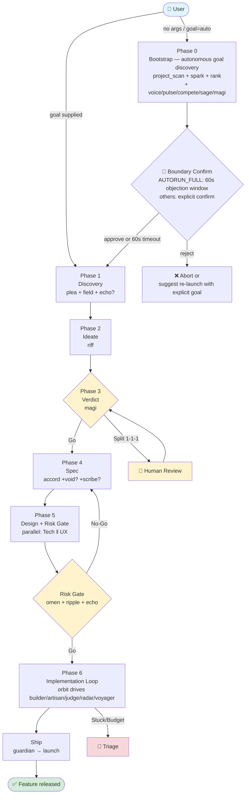
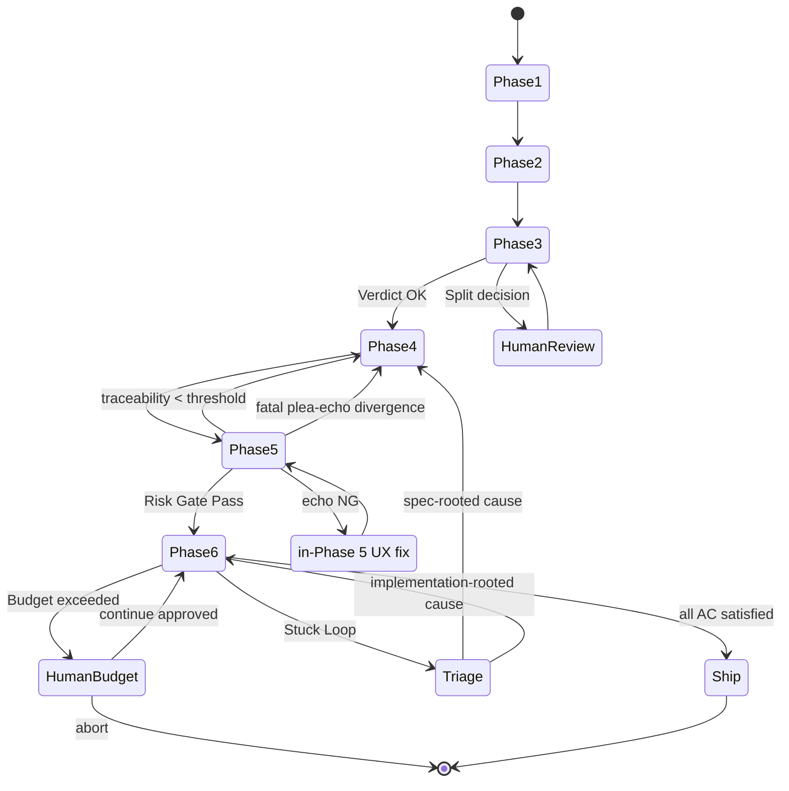
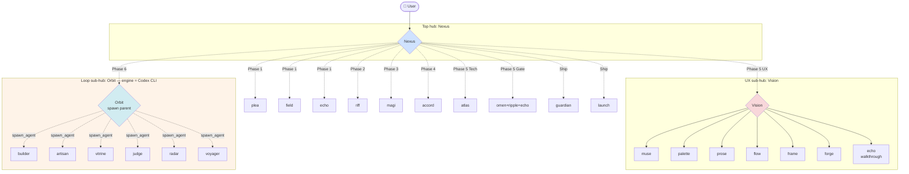
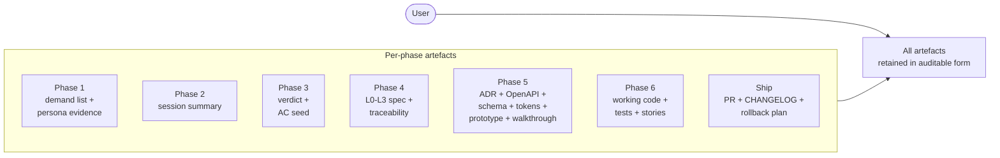

# Nexus Apex Walkthrough — Visualising the Workflow and What Happens

**Purpose:** Human-facing document that illustrates, phase by phase, what happens when `/nexus apex` runs — which agent produces what, where the workflow stops or branches, and how to read the topology.
**Read when:** First-time apex users, when explaining the recipe to a team, when reviewing per-phase responsibilities, or when locating "where am I now?" during trouble.
**Companion:** The technical contract is in `apex-recipe.md`; this document is its narrative visualisation.

---

## 1. End-to-end Overview



**Colour legend**: 🟦 entry / 🟩 done / 🟨 decision gate / 🟥 escalation

---

## 3. Failure and Rollback Flow



---

## 4. Two-tier Hub Topology



**Design rationale**: top-level Nexus directly fans out to ~10 agents only; the 9 UX agents hide under Vision and the 6 loop agents hide under Orbit. This preserves the "specialists ≤ 7-10 per orchestrator" principle. **Furthermore, LOOPHUB executes on Codex CLI and is fully isolated from the Claude Code session's context budget.**

---

## 5. Time and Cost Profile

| Profile | Agent count | Time estimate | Cost estimate | Use case |
|---|---|---|---|---|
| **Lite** | 8-10 | 60-90 min | Low | Backend-only feature, accord=Lite |
| **Standard** | 14-18 | 2-3 hours | Medium | Typical UI-bearing feature |
| **Full** | 20-25 | 3-5 hours | High | Greenfield, accord=Full, Figma integration, multi-locale |
| **+Phase 0 (autonomous mode)** | +4-8 | +15-25 min | +10-20% | Goal also auto-selected when launched with no args |

> Note: times depend on network and model latency. Each phase has a verification gate, so this is **total elapsed time**, not the bandwidth of parallel processing.

---

## 6. What Remains as Artefacts



**Primary artefacts that persist after implementation**:
- `docs/specs/<feature>.md` (accord)
- `docs/adr/ADR-NNNN.md` (atlas)
- `docs/api/openapi.yaml` (gateway)
- `docs/design/tokens.json` (muse)
- Storybook (vitrine)
- E2E persona scenarios (voyager)
- Release notes + rollback procedure (launch)

All of these are auto-generated as apex by-products, so what remains is not just **"working code"** but **"explainable functionality"**.

---

## 7. Invocation Examples (copy-pasteable)

> Invocation forms (autonomous no-args, goal-supplied, mode overrides) are listed in `apex-recipe.md` / `nexus/SKILL.md` § Subcommand Dispatch. This section keeps only the interruption-handling demo, which is walkthrough-specific.

### Stopping mid-flight

```bash
# In autonomous mode, any input within the 60s window stops immediately
> /nexus apex
... Proposal: "fine-grained notification controls" ... stop within 60s by typing anything
> stop                    # ← any input aborts
Aborted. To choose differently:
  /nexus apex specify a different goal directly
```

After execution, Nexus returns a `## Nexus Execution Report` with the Phase 0 selection log plus Status / Output / Handoff for Phases 1-6. In autonomous mode, the rationale for `auto_selected_goal` and its `rejected_alternatives` are also persisted, so "why we did not pick a different feature" remains auditable.
